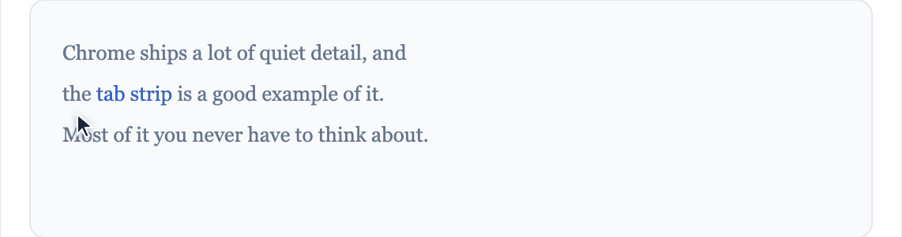

# HyLink — hover link menu for Chrome

Hover over any link and a small menu appears beside it. Move the cursor onto it and you
get eight ways to act on that link — open it here, in a new tab, a new window, incognito,
side by side or stacked, or copy it with or without tracking parameters. All right at
your fingertips instead of a right-click and a menu away.

<picture>
  <source media="(prefers-color-scheme: dark)" srcset="docs/demo-dark.gif">
  
</picture>

## Why

Opening a link anywhere other than the current tab means right-click → find the item →
click, dozens of times a day. I wanted those options next to the link I'm already
pointing at — and out of the way when I'm just reading.

## Install

**[Add to Chrome from the Chrome Web Store](https://chromewebstore.google.com/detail/hylink-%E2%80%94-hover-link-menu/nkgldnfhefcflmlomgndaadbhhdohjaj)** — one click, and updates arrive
on their own.

To use **Open in incognito**, also enable **Allow in incognito** for HyLink on
`chrome://extensions`. Chrome doesn't let extensions grant that themselves. Until it's
enabled, the menu tells you so rather than silently doing nothing.

### About that "read and change all your data" warning

Chrome shows it to every extension that runs on every site, and it describes what the
permission *allows*, not what the extension *does*. Links exist on every page, so a
hover menu has to run everywhere — there's no narrower permission to ask for.

What HyLink actually does with it:

- **Reads** two things: the `href` of the link under your pointer, and the tag and
  class names of its ancestors, to work out whether that link is in a nav bar. Plus
  enough layout to place the menu where it won't cover a hover card.
- **Never reads** page text, form fields, passwords, cookies or browsing history.
- **Sends nothing anywhere.** There is no server, no analytics, no telemetry, and no
  network code of any kind — `node tests/run.js` fails the build if a `fetch`,
  `XMLHttpRequest`, `WebSocket` or `sendBeacon` ever appears in the shipped source.
- **Stores** only your own settings, in `chrome.storage.sync`, which syncs through
  your Chrome profile and never reaches anyone else.

The code is all here to check, and [PRIVACY.md](PRIVACY.md) sets it out in full.

### Running it unpacked

For hacking on it, or to run a version before it clears review:

```
git clone https://github.com/abhijitgore/hylink.git
```

1. Open `chrome://extensions` and turn on **Developer mode**.
2. Click **Load unpacked** and choose the cloned folder.
3. Reload any tabs that were already open — the extension only attaches when a page loads.

Homebrew keeps that copy up to date:

```
brew install --cask abhijitgore/tap/hylink
```

It installs to `~/Library/Application Support/HyLink`, which you point **Load unpacked**
at once. The path survives `brew upgrade`, so later upgrades just need **Reload** on
`chrome://extensions`. `brew uninstall --cask hylink` removes it.

Don't run an unpacked copy and the Web Store one at the same time — you'll get two menus
on every link.

## The menu

Move the cursor onto the three dots and they expand into the action bar:

| Icon | Action | What it does |
| --- | --- | --- |
|  | **Open link** | Opens the link in the current tab. |
|  | **Open in new tab** | Opens it in a new tab right after the current one. |
|  | **Open in new window** | Opens it in a new, normally-sized window. |
|  | **Open in incognito** | Opens it in an existing incognito window, or creates one. Needs *Allow in incognito* — see [Install](#install). |
|  | **Open in side (right)** | If the tab is **already in a Chrome split view**, opens it in the other pane. Otherwise moves the current window to the **left half** of the screen and opens the link in a new window on the **right half**. |
|  | **Open in side (stacked)** | Same split-view behaviour; otherwise moves the current window to the **top half** and opens the link in a new window on the **bottom half**. |
|  | **Copy link address** | Copies the full URL to the clipboard. |
|  | **Copy clean link** | Copies the URL with tracking parameters removed, the way Brave's *Copy clean link* does. Hover the button to see how many will be removed before you click. |

## How "open in side" works

**This is not Chrome's real Split View, and it can't be yet.** Chrome 140 added Split
View, but the extension API is read-only: `tabs.splitViewId` lets an extension *detect*
a split view and nothing more. The proposal for a create API
([w3c/webextensions#967](https://github.com/w3c/webextensions/issues/967)) was opened in
March 2026 and is still open. For now only Chrome's own right-click →
**Open link in split view** can make one. When that API ships, this becomes a small
change. Until then, HyLink does the two things it can:

1. **Reuse an existing split view.** If the link's tab is already one pane of a split
   view, either side action opens the link in the other pane — no new window. The API
   doesn't expose the orientation, so both actions fill whichever sibling pane you
   already have; they only differ when there is no split view. Detecting one needs
   **Chrome 140+**; older Chrome skips this step.
2. **Otherwise, tile two real windows.** Most sites refuse to render inside an iframe
   (`X-Frame-Options` / CSP `frame-ancestors`), which rules out side panels and
   injected panes, so HyLink uses `chrome.windows` and `chrome.system.display`. It
   restores the current window from maximized/fullscreen first, because Chrome ignores
   bounds on a maximized window and rejects `state` plus bounds in a single call. It
   sizes the halves from the display's **work area**, so neither window lands under the
   macOS Dock or the Windows taskbar, and falls back to the current window's own bounds
   if the display API is unavailable. The result looks like a split view but is a second
   window, not a pane.

## Staying out of the way

A toolbar popping up over every link you pass would make pages unreadable, so nothing
appears until you mean it:

1. **You need to hover the mouse over the link to activate it.** Moving more than a few
   pixels restarts the delay, so sweeping across text while reading never triggers
   anything.
2. **Three dots appear** just past the end of the link, in a small frosted capsule about
   one character wide. It's translucent so the text still shows through, and it fades
   out ~160 ms after you move away. It turns solid the moment the cursor reaches it.
3. **Move the cursor onto the capsule** and the full action bar opens out of it, so it
   stays under the cursor. Hold the modifier key to skip straight to the bar.

**The menu is only shown for links in paragraphs and body text.** It is not shown for
elements like navigation bars, headers, footers and sidebars — `<nav>`, `<header>`,
`<footer>`, `<aside>`, anything with a navigational role, and div-soup equivalents with
class or id names like `sidebar`, `navbar`, `breadcrumbs` or `toolbar`. Names are
matched on token boundaries, so `table-wrapper` doesn't match `tabs`. To get the menu
on a navigation link anyway, hold the modifier key, or turn off **Skip navigation,
headers and sidebars** in the options.

Scrolling closes the menu — if you're scrolling, you're reading, not clicking. Prefer
the full menu immediately on hover? Set **Show the full menu right away** in options.

## Settings

The options page opens once on install and starts with a looping animation of the whole
interaction. It's drawn in CSS with the real icon set, so it stays sharp on any display,
follows your colour scheme, and can't drift out of date with the menu. With
`prefers-reduced-motion` it shows the final frame as a still.

Click the HyLink toolbar icon for an on/off switch and a "disable on this site" toggle,
or open **All settings…** for:

- **Grip or full menu** on hover.
- **Skip navigation, headers and sidebars** (on by default).
- **Hover delay** (default 220 ms) before the dots appear.
- **Modifier key** — optionally require Alt/Ctrl/Shift/Cmd to be held.
- **Which of the eight actions** appear in the bar, **and in what order** — drag a row
  or use the arrow buttons; the menu on every open tab follows along without a reload.
- **Foreground or background** new tabs.
- **Remove tracking parameters from links you open** (on by default) — see
  [Clean links](#clean-links).
- **Disabled sites** — one hostname per line; each entry also covers its subdomains.

Press <kbd>Esc</kbd>, click elsewhere, scroll, or move the mouse away to dismiss the
menu.

## Languages

The menu, popup and options page follow Chrome's language setting:

| | | |
| --- | --- | --- |
| English (`en`) | Español (`es`) | Português do Brasil (`pt_BR`) |
| Русский (`ru`) | हिन्दी (`hi`) | Français (`fr`) |
| Deutsch (`de`) | 日本語 (`ja`) | Bahasa Indonesia (`id`) |
| Türkçe (`tr`) | | |

Anything else falls back to English, as does any string missing from a catalogue —
`default_locale` is `en`. Regional variants like `en_GB`, `es_419` and `pt_PT` resolve
to the closest catalogue on their own.

Only the extension's own UI is translated. The manifest's name and description stay in
English on purpose — they're store copy, translated in the developer dashboard rather
than from `_locales/`.

The nine non-English catalogues were not written by native speakers, so corrections are
welcome. `node tests/run.js` checks that every catalogue has the same keys as `en` and
keeps its `$placeholders$`.

## Clean links

**Copy clean link** removes tracking parameters before the URL reaches your clipboard —
`utm_*`, `fbclid`, `gclid`, `si`, Amazon's `ref_`, and several hundred more — so what
you paste is the page, not a record of how you got there.

**Links you open are cleaned too, by default.** Opening in a new tab, a new window,
incognito or a side window all navigate to the stripped URL — a link you are following
has no use for the campaign tag that came with it. Turn off **Remove tracking parameters
from links you open** in the options to get the URL passed through untouched.

The copy buttons stay out of that: **Copy link address** always hands over the link
exactly as it is, and **Copy clean link** is always the one that strips. They sit a
click apart and neither depends on the setting, so whichever you want is one press away.

Anything the menu opens is cleaned in the service worker, on its side of the privilege
boundary, rather than being cleaned in the page and taken on trust.

The rules are Brave's, copied verbatim from
[brave/adblock-lists](https://github.com/brave/adblock-lists/blob/master/brave-lists/clean-urls.json)
into `src/clean-list.js`, plus the click identifiers from Brave's navigation-time query
filter, which that list leaves out because Brave applies both passes to a copied link.
Refresh them with:

```
node tools/build-clean-list.js          # or pass a local path
```

Two deliberate limits: it only touches `http`/`https` URLs, and it never re-encodes a
URL that had nothing to remove — the link comes back byte-for-byte unless something was
actually stripped. Site-scoped rules stay scoped, so YouTube's `si` is removed from a
`/watch` link and nowhere else.

`src/clean-list.js` is under Brave's Mozilla Public License 2.0, noted in its header and
in [NOTICE.md](NOTICE.md); the rest of HyLink is MIT, see [LICENSE](LICENSE). Cleaning
runs in the service worker, so the rule list is never injected into the pages you visit.

## Layout

```
manifest.json
src/settings.js     shared defaults, storage helpers, denylist matching
src/icons.js        the menu's icon set, shared with the options page and README
docs/icons/         GENERATED from it for the table above; see tools/build-readme-icons.js
_locales/           ten UI translations; `en` is the fallback
ui/i18n.js          fills the pages from _locales, keeping the English as a fallback
src/clean.js        tracking-parameter removal (worker only)
src/clean-list.js   GENERATED — Brave's rules, MPL-2.0; see tools/build-clean-list.js
src/content.js      hover detection + top-layer shadow-DOM menu (all frames)
src/tiling.js       display work-area math and window placement
src/background.js   service worker; split-view reuse, tabs/windows privileges
ui/                 options page and toolbar popup
tests/run.js        `node tests/run.js` — 196 assertions, no dependencies
tools/              regenerates the clean-link rules, the icons and the store assets
tests/harness/      manual page for hover timing and overlay-dodging
icons/
```

## Tests

```
node tests/run.js
```

Loads each module into a vm context with a stubbed `chrome` and asserts on the API
calls it makes: settings normalization, denylist matching, tiling geometry against a
maximized window on a secondary display, the URL scheme guard (rejections *and*
acceptances), tab placement, and every split-view fallback path.

`tests/harness/` is a page for the parts that need a real browser — hover timing,
top-layer rendering, stepping around a hover card, and the navigation denylist against
a real nav bar and sidebar. Run `tests/harness/build.sh` first. See its README.

## Publishing

[RELEASING.md](RELEASING.md) is the release checklist. The important part: the
[Homebrew tap](https://github.com/abhijitgore/homebrew-tap) pins a version and a
tarball checksum, so a new tag here isn't done until the cask there is bumped. Nothing
errors if they drift — `brew install` just keeps serving the old version.

HyLink is published at [chromewebstore.google.com](https://chromewebstore.google.com/detail/hylink-%E2%80%94-hover-link-menu/nkgldnfhefcflmlomgndaadbhhdohjaj).
`docs/store-listing.md` has everything the dashboard asks for: single-purpose statement,
listing copy, permission justifications, privacy answers. The screenshots and the
440×280 promo tile are in `docs/store/`, and `PRIVACY.md` is the privacy policy, hosted
at a public URL.

`node tests/run.js` guards the mechanical parts: manifest version, the 132-character
description limit, icon sizes, the permission set, no remote code, no inline scripts,
no `unload` handlers, and no harvestable email address in any Markdown file.

## Notes and limits

- **Permissions**: `storage`, `system.display`, `activeTab`. Every one of these is a
  line on the install prompt, so the list is kept short. `tabs` is deliberately *not*
  requested — nothing here needs it, and it would add a "read your browsing history"
  warning. `clipboardWrite` isn't requested either: copying happens in the page inside
  the click's own user activation, which needs no permission.
- Only `http`, `https`, `ftp` and `file` links get a menu. `javascript:` and bare `#`
  links are ignored, and the service worker re-checks the scheme before touching any
  tabs/windows API.
- `file://` links need **Allow access to file URLs** enabled for HyLink on
  `chrome://extensions`. Without it Chrome rejects the tab/window, and the menu caption
  says so.
- **Open link** sets `location.href`, so on a single-page app it does a full
  navigation rather than a client-side route change.
- The menu can't appear on `chrome://` pages, the Chrome Web Store, or other
  extensions' pages — Chrome blocks content scripts there.
- Copying uses the async clipboard API, with a hidden-textarea fallback on insecure
  (`http`) origins.
- The menu renders in the browser's **top layer** (Popover API), so page overlays like
  Wikipedia's link previews can't cover it — and it stays out of *their* way too. It
  tries six positions around the link and picks one clear of any hover card, tooltip
  or sticky header, re-checking when an overlay arrives after the menu (Wikipedia's
  lands ~100 ms later). Without popover support it falls back to a maximum `z-index`.
